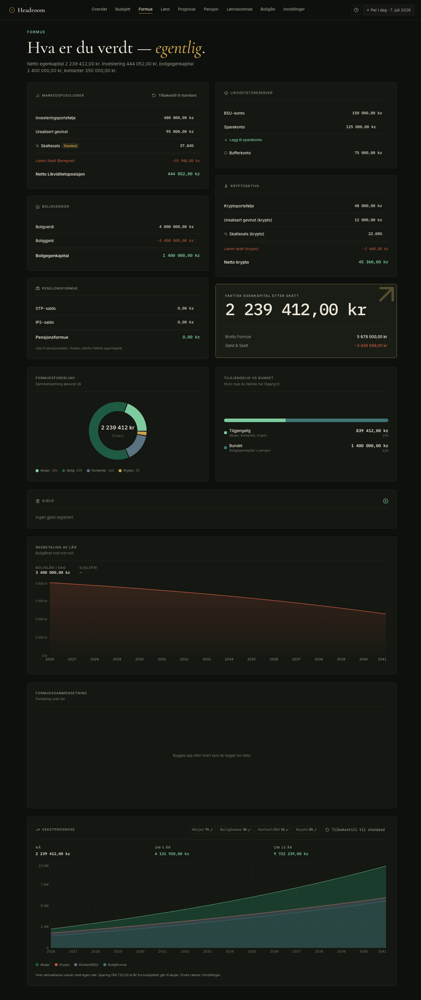

<div align="center">

# Headroom

### Budgets · Assets · Investments · Loan modeling

[](https://react.dev/) [](https://www.typescriptlang.org/) [](https://vite.dev/) [](https://www.docker.com/) [](https://www.sqlite.org/)

[](https://github.com/mortennordbye/headroom/actions/workflows/build.yml) [](https://scorecard.dev/viewer/?uri=github.com/mortennordbye/headroom)

[](LICENSE) [](https://github.com/mortennordbye/headroom/commits/main) [](https://github.com/mortennordbye/headroom/issues) [](https://github.com/mortennordbye/headroom/stargazers)

A self-hosted personal finance tracker. Track monthly budgets, manage assets and investments, model housing loans, and get smart spending recommendations. All data is stored server-side in a SQLite database via Docker — zero browser storage. Norwegian is natively supported.

| Dashboard | Budget |
|-----------|--------|
|  |  |



</div>

## Features

Track monthly budgets with variable-income support, fixed expenses, a daily transaction log, and a spend/invest split that adapts automatically to your income history. The dashboard gives a live view of total equity, budget health, asset allocation, and a running net worth chart.

Assets covers your investment portfolio, property equity, crypto, and cash reserves with tax-aware calculations and a 15-year growth projection. The loan calculator handles first-time buyer, homeowner, and buy-and-sell scenarios with full amortization schedules and tax benefit calculations. Supports NOK, USD, or any custom currency, and ships with full Norwegian and English translations.

## Run it on your laptop

Headroom is happiest as a small private app on your own machine. All you need is Docker:

- **macOS / Windows** — [Docker Desktop](https://www.docker.com/products/docker-desktop/) (free).
- **Linux** — [Docker Engine](https://docs.docker.com/engine/install/).

No accounts, no cloud, no config files. Your data lives on your machine and never leaves it.

**Option A — pre-built image (recommended, no clone, nothing to build):**

```bash
docker run -d \
  --name headroom \
  -p 127.0.0.1:8080:3001 \
  -v headroom_data:/data \
  --restart unless-stopped \
  ghcr.io/mortennordbye/headroom:latest
```

**Option B — build from source** (if you want to modify it; also needs [Make](https://www.gnu.org/software/make/)):

```bash
git clone https://github.com/mortennordbye/headroom.git
cd headroom
make build
```

Either way, open **http://localhost:8080** and you're done — **no config files, no environment variables required.**

- The `--restart unless-stopped` flag (and `make up`) means it comes back automatically after you reboot your laptop, so it's always there when you open the browser.
- Everything you enter is saved in the **`headroom_data`** volume on your machine. It survives restarts, reboots, and updates (see [Updating](#updating) and [Data persistence](#data-persistence)).

**Later, want it on a home server or another device?** Change the port binding (`-p 8080:3001` for all interfaces, or map it into a reverse proxy) — nothing else changes. Read [Security](#security) first: there's no login, so don't expose it to the open internet without a proxy or VPN in front.

## Updating

New versions never touch your data — it's in the `headroom_data` volume, separate from the app. To move to a newer version:

**Option A — pre-built image:**

```bash
docker pull ghcr.io/mortennordbye/headroom:latest   # get the new version
docker rm -f headroom                                # remove the old container (NOT the volume)
docker run -d \
  --name headroom \
  -p 127.0.0.1:8080:3001 \
  -v headroom_data:/data \
  --restart unless-stopped \
  ghcr.io/mortennordbye/headroom:latest              # start the new one, same volume
```

**Option B — from source:**

```bash
git pull
make build
```

Because you re-attach the same `-v headroom_data:/data` volume (Option A) or reuse the same Docker Compose volume (Option B, via `make build`), **all your budgets, transactions, and settings carry over untouched.** Only `docker-compose down -v` or deleting the volume by hand ever removes data.

> **Tip:** before a big update, it costs nothing to take a snapshot first — `make backup`, or **Settings → Export** in the app (see [Data persistence](#data-persistence)).

> **Browser shows an old version after updating?** The app is a PWA and caches itself. Accept the "new version available" prompt, or hard-reload (Cmd/Ctrl+Shift+R). Your data is unaffected — this is only the UI cache.

## Commands

| Command | Description |
|---------|-------------|
| `make build` | Build image and start (also rebuilds if already running) |
| `make up` | Start without rebuilding |
| `make down` | Stop all containers |
| `make restart` | Restart without rebuilding |
| `make backup` | Copy the SQLite database to `./backups/` (timestamped) |

## Local development (without Docker)

_For contributors hacking on the code — if you just want to **use** Headroom on your laptop, use [Run it on your laptop](#run-it-on-your-laptop) above instead._

For iterating on the frontend you can run the API and Vite dev server directly:

```bash
npm install
node server/index.js          # API on :3001 (writes to ./data)
npm run dev                   # Vite on :5173, proxies /api → :3001
make seed-local               # optional: seed ./data with demo data
```

`npm test` runs the Vitest suite; `npm run lint` runs ESLint.

## Security

Headroom has **no login** — it's built for single-user self-hosting, and anyone who can reach the port can read and overwrite your entire financial picture. So there are exactly **two safe ways to run it:**

1. **Local only (default).** The port binds to `127.0.0.1` (loopback), so the app is reachable only from the machine it runs on. This is the recommended setup for a laptop.
2. **In a locked-down homelab, reached over a private tunnel.** Host it on a home server and get to it through **WireGuard**, **Tailscale**, or a VPN — nothing is exposed to the public internet, and only your own devices (including your phone) can reach it.

**Do not put it directly on the open internet.** If you want it reachable from a browser without a VPN, it must sit behind a reverse proxy (nginx, Caddy, Traefik) that adds authentication (basic auth or an SSO/identity layer) — and ideally HTTPS.

Only change the port binding to `0.0.0.0` (all interfaces) if you understand that this exposes unauthenticated access to everyone who can reach that network.

**Optional hardening:** set `ALLOWED_HOSTS` (see [Configuration](#configuration)) to reject requests whose `Host` header isn't one you expect — a small guard against DNS-rebinding. It's off by default so the app works behind any hostname without configuration.

## Use it on your phone

Headroom has a full mobile layout and is a **PWA (installable web app)** — you can add it to your phone's home screen and it opens fullscreen with its own icon, just like a native app. There's nothing to install from an app store.

**This only works if your phone can reach the server.** That rules out the laptop-only setup (`localhost` is just the laptop) — you need the **homelab + private tunnel** option from [Security](#security): host it on a home server and connect your phone over **WireGuard** or **Tailscale** first. Then open the app's address (e.g. `http://headroom.local` or the server's IP) on the phone.

**iPhone / iPad (Safari)** — iOS only installs web apps from Safari, not Chrome:

1. Connect your WireGuard/Tailscale tunnel so the phone can reach the server.
2. Open the app's URL in **Safari**.
3. Tap the **Share** button (the square with an upward arrow).
4. Scroll down and tap **Add to Home Screen**.
5. Keep the name "Headroom", tap **Add**.

It now sits on your home screen and launches fullscreen in the mobile view.

**Android (Chrome):** open the URL, tap the **⋮** menu → **Install app** / **Add to Home screen**.

> **HTTPS recommended.** For the full PWA experience — offline app-shell caching and the "new version" update prompt — serve it over HTTPS (a reverse proxy with a certificate, or Tailscale's HTTPS). Over plain `http://`, iOS still lets you Add to Home Screen, but the service worker (offline caching) won't register.

## Configuration

All optional — the defaults are sensible and nothing needs to be set.

| Env var | Default | Purpose |
|---------|---------|---------|
| `DATA_DIR` | `/data` (in Docker) | Where the SQLite database is stored. |
| `PORT` | `3001` | Port the server listens on inside the container. |
| `ALLOWED_HOSTS` | _(unset — all hosts allowed)_ | Comma-separated hostname allowlist, e.g. `finance.example.com,localhost`. When unset, no host filtering is applied. |

## Data persistence

Everything you enter lives in one SQLite database inside the named Docker volume **`headroom_data`** on your machine — there is no browser storage and nothing in the cloud. The volume is independent of the container, which is what makes your data stick around.

**Your data survives:**
- Stopping/starting the app (`make down` / `make up`, or `docker stop`/`start`)
- Rebooting your laptop
- Updating to a new version (see [Updating](#updating))

**Your data is only removed if you explicitly delete it:**
- `docker-compose down -v` (the `-v` deletes the volume), or
- `docker volume rm headroom_data`

### Backups

The volume is the only live copy, so keep a backup — two easy options:

1. **In-app export (best, portable).** **Settings → Export** downloads your entire state as a single JSON file. This is the safest backup: it's independent of Docker, survives losing the volume, and can be imported on a fresh install or a different machine via **Settings → Import**. Because it holds your full accumulated transaction history, an occasional export is a complete backup.
2. **Database snapshot.** `make backup` copies the SQLite file to `./backups/` (timestamped, gitignored).

### Restore

- From a JSON export: open the app and use **Settings → Import**.
- From a SQLite snapshot: `docker cp backups/<file>.sqlite headroom:/data/database.sqlite && make restart` (for the pre-built image, replace `make restart` with `docker restart headroom`).

> Bank sync only reaches ~90 days back per fetch, but stored transactions are never dropped — they accumulate as you keep syncing. So your history keeps growing on your machine, and an export captures all of it. Sync regularly (don't leave gaps longer than ~90 days) and export now and then, and you have a durable, ever-growing record.

## Tech stack

| Layer | Technology |
|-------|-----------|
| Frontend | React 19, TypeScript, Vite, Tailwind CSS v4 |
| Charts | Recharts |
| Backend | Node.js, Express |
| Database | SQLite (better-sqlite3) |
| Serving | Express (static files) |
| Containers | Docker, Docker Compose |

## Repository structure

> **Note:** A simplified view of the main folders. Generated/ignored directories (`node_modules/`, `dist/`, `data/`, `backups/`) are omitted.

```
headroom
├── server/              # Express API + SQLite persistence
│   ├── index.js         # API, static SPA serving, host allowlist
│   ├── bank.js          # Bank-sync integration
│   ├── ssb.js           # SSB inflation fetch
│   └── seed.js          # Demo-data seeding
├── src/
│   ├── context/         # FinanceContext — single source of app state
│   ├── lib/             # Pure calc/domain logic + Vitest tests (tax, loan, debt)
│   ├── pages/           # One component per route (Budget, Dashboard, Assets…)
│   ├── components/      # Shared UI (modals, charts) + ui/ primitives
│   ├── hooks/           # Small shared hooks
│   ├── i18n/            # Translation tables
│   └── assets/          # Static assets
├── public/              # PWA manifest and icons
├── scripts/             # Enable Banking extractor (optional)
└── Dockerfile
```

## CI/CD workflows

| Workflow | Trigger | Purpose |
|----------|---------|---------|
| [**CI**](.github/workflows/build.yml) | Push to `main`, PRs, manual | Typecheck, lint, test, then build and push the Docker image to GHCR |
| [**Dependency Review**](.github/workflows/dependency-review.yml) | PRs | Blocks PRs that introduce known-vulnerable dependencies |
| [**Scorecard**](.github/workflows/scorecard.yml) | Push to `main`, weekly | OpenSSF supply-chain score published to the Security tab |
| [**Container Scan**](.github/workflows/container-scan.yml) | Push to `main`, weekly | Trivy scan of the image; findings to the Security tab |
| [**Dependabot**](.github/dependabot.yml) | Weekly | Grouped dependency-update PRs (npm root + `server/`, GitHub Actions) |

---

<div align="center">

### ⭐ Star this repo if you find it useful ⭐

<a href="https://www.star-history.com/#mortennordbye/headroom&Date">
  <picture>
    <source media="(prefers-color-scheme: dark)" srcset="https://api.star-history.com/svg?repos=mortennordbye/headroom&type=Date&theme=dark" />
    <source media="(prefers-color-scheme: light)" srcset="https://api.star-history.com/svg?repos=mortennordbye/headroom&type=Date" />
    
  </picture>
</a>

Made by [Morten Nordbye](https://nordbye.it/)

</div>
