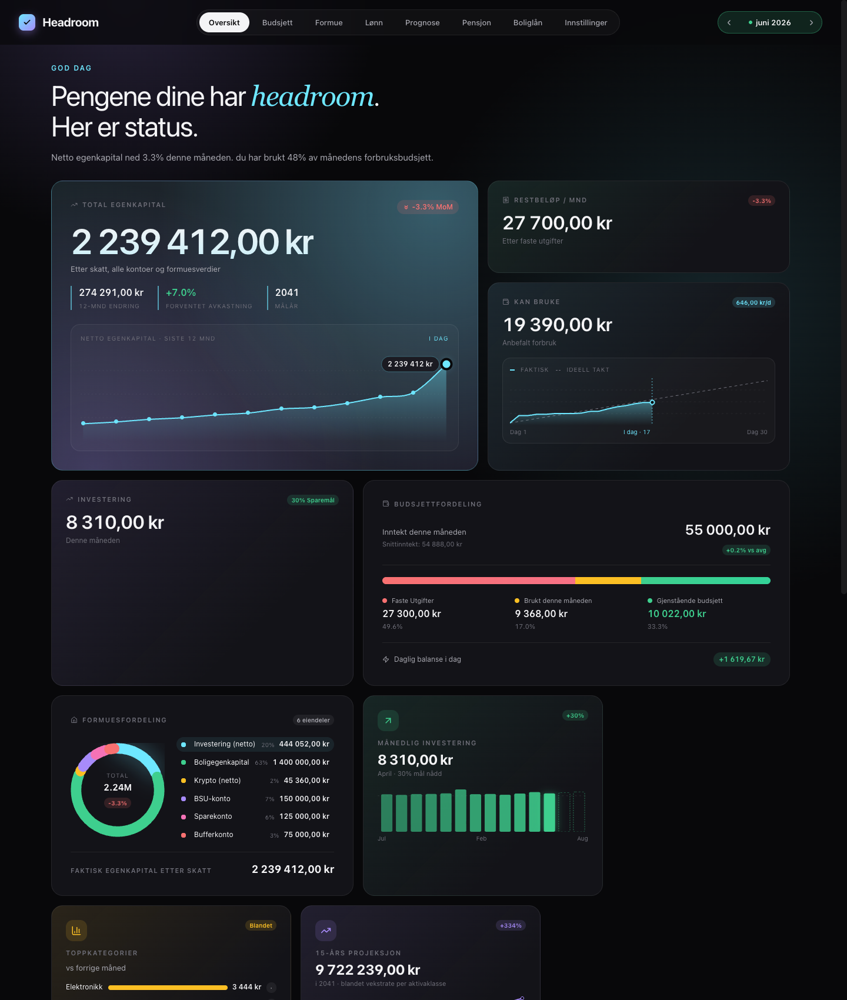
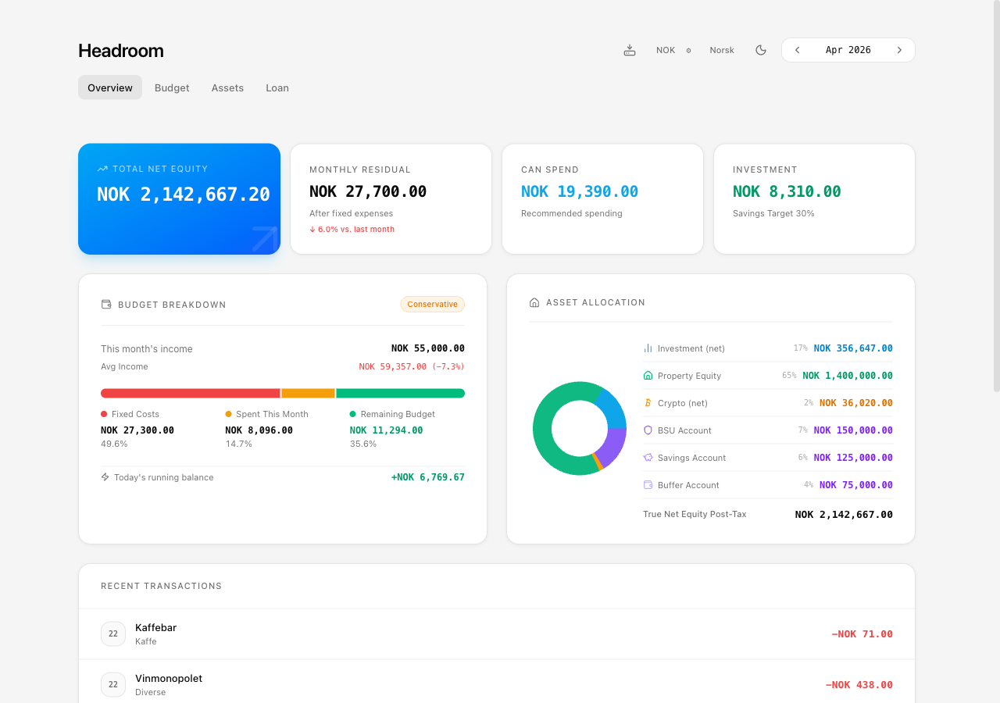
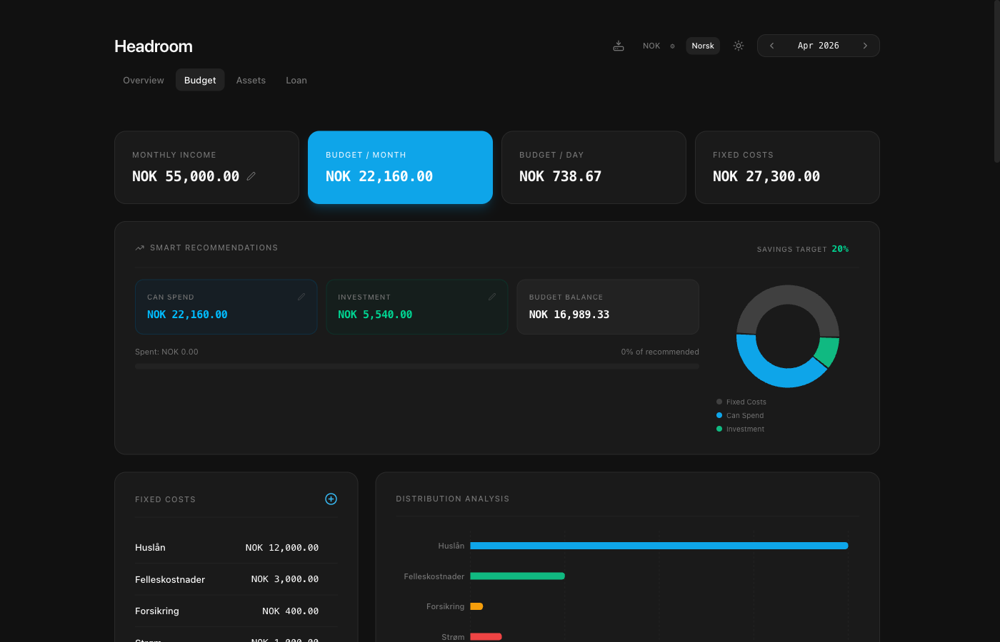
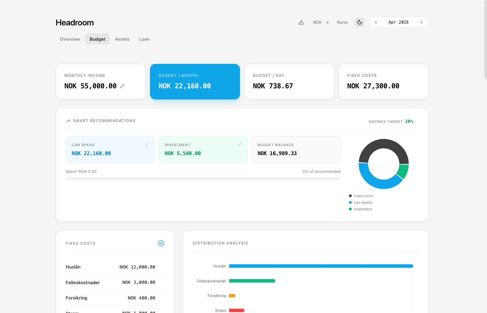

# Headroom

A personal finance tracker built for Norwegian users — and anyone else who wants to stay on top of their money. Track monthly budgets, manage assets and investments, model housing loans, and get smart spending recommendations. All data is stored server-side in a SQLite database via Docker. Zero browser storage.

| Dark mode | Light mode |
|-----------|------------|
|  |  |
|  |  |

## Features

Track monthly budgets with variable-income support, fixed expenses, a daily transaction log, and a spend/invest split that adapts automatically to your income history. The dashboard gives a live view of total equity, budget health, asset allocation, and a running net worth chart.

Assets covers your investment portfolio, property equity, crypto, and cash reserves with tax-aware calculations and a 15-year growth projection. The loan calculator handles first-time buyer, homeowner, and buy-and-sell scenarios with full amortization schedules and tax benefit calculations. Supports NOK, USD, or any custom currency, and ships with full Norwegian and English translations.

## Quick start

**Using the pre-built image** — the fastest way, no clone required:

```bash
docker run -d \
  --name headroom \
  -p 8080:3001 \
  -v headroom_data:/data \
  --restart unless-stopped \
  ghcr.io/mortennordbye/headroom:latest
```

**Building from source** — requires [Docker](https://docs.docker.com/get-docker/) and [Make](https://www.gnu.org/software/make/):

```bash
git clone https://github.com/mortennordbye/headroom.git
cd headroom
make build
```

Open http://localhost:8080.

## Commands

| Command | Description |
|---------|-------------|
| `make build` | Build image and start (also rebuilds if already running) |
| `make up` | Start without rebuilding |
| `make down` | Stop all containers |
| `make restart` | Restart without rebuilding |

## Data persistence

All data lives in a named Docker volume (`headroom_data`). Running `make down` keeps your data intact. To wipe everything:

```bash
docker-compose down -v
```

## Tech stack

| Layer | Technology |
|-------|-----------|
| Frontend | React 19, TypeScript, Vite, Tailwind CSS v4 |
| Charts | Recharts |
| Backend | Node.js, Express |
| Database | SQLite (better-sqlite3) |
| Serving | Express (static files) |
| Containers | Docker, Docker Compose |
